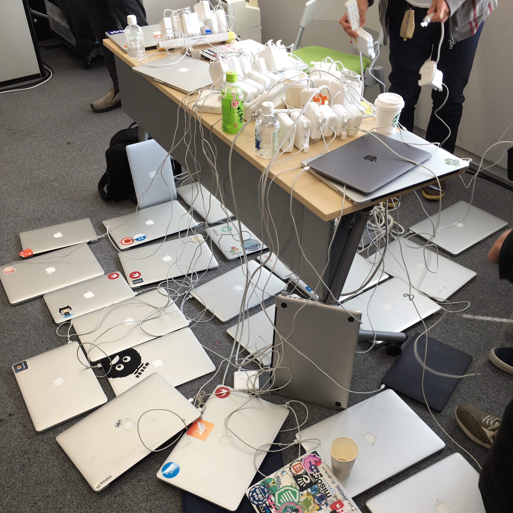
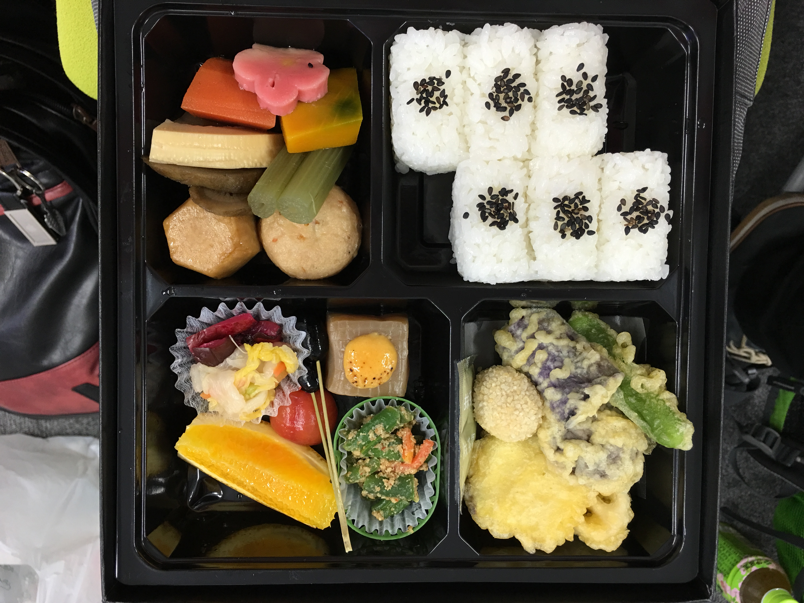
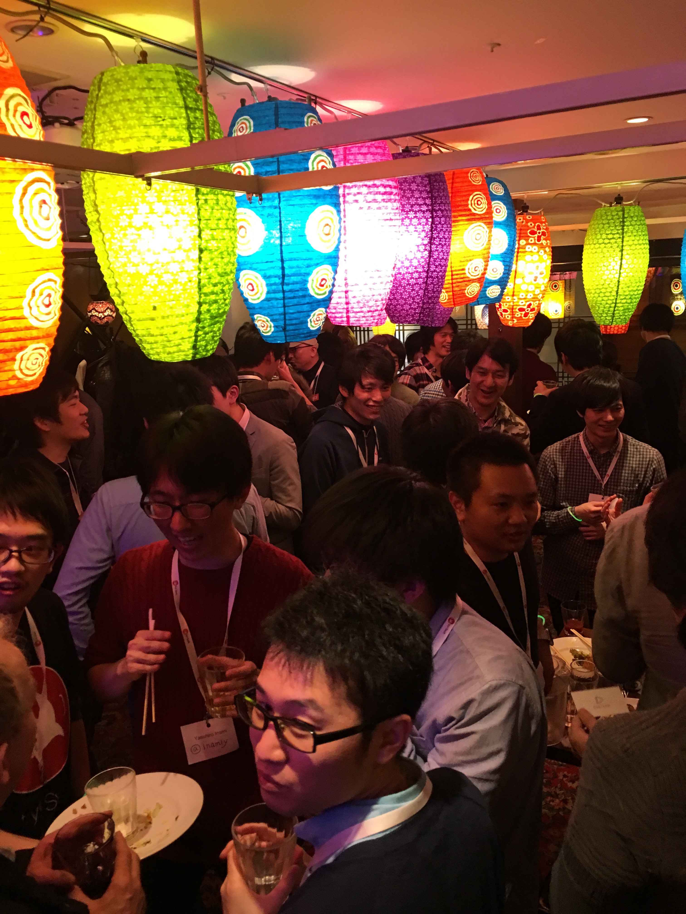

try! Swift Conf に参加してきた。
=========

ありがたいことに 3/2 から 3/4 にかけて [try! Swift conf](http://www.tryswiftconf.com/) に **スポンサー枠** で参加してきました。

行きたいなーでも個人でチケット買うには高いな…（全日程行こうと思ったら三万円:money_with_wings::money_with_wings::money_with_wings:）と二の足を踏んでたところにスポンサー枠チケットあるとの話を聞いて反射的に手を挙げたところ、実際に行かせて頂いて会社に圧倒的感謝 :pray::pray::pray:

# カンファレンスの要約

主催の [kishikawakatsumi](https://github.com/kishikawakatsumi) 氏が国内外含めた iOS エンジニアの中でも間違いなく第一線で活躍している方で、その方の呼び掛けもあって国内外の著名な iOS アプリケーションエンジニアが一堂に会する機会となりました。

凄い人が声掛けたから凄い人達が集まったよ、という感じですね。勉強会の質は主催者の力量によるなと痛感させられる感じでもあります。

# 非技術者へ向けての小噺

こういうエンジニア向けのカンファレンスとか勉強会に行くと常に雇用の流動性を感じます。

集まる人はあまり変わらない（書ける人は今も昔も変わらず書けるみたいな）けど所属してる会社は変わってるみたいな感じで同窓会のような様相になります。

こういうところにスポンサーとしてお金を出して企業の存在感をアピールしていくのは **「我々は技術者の文化を大事にしますよ！技術の発展を願ってます！！一緒に作っていきましょう！！！」** というメッセージにもなり、会社の守りのブランディングとして大事だなぁと思います。

逆に、昨今ではこういうカンファレンスに出向いては直接人を雇う・ "We are hiring!!" とアピールすることは流行っていないように感じます。そういった攻めのブランディングではなく、 **「優秀なエンジニアが集まるところには金と時間を提供するのが IT 企業としての社会的な責任だよね」** みたいな風潮になってるのかもしれない **（完全に個人の主観です）**。

僕はたまたまプログラマとしてエンジニア向けのカンファレンスに参加して上記の様な感想を抱きましたが、恐らくエンジニアだろうがなんだろうがあまり関係ない話として、オープンに人が集まるところ・社会的な責任をアピールできそうなところにスポンサーとしてリソースを提供することの大事さというものは一定存在すると思いますので、そういうところで常にクールな企業でいたいですねという感じです。

# カンファレンスや懇親会の雰囲気

- 昼休みに充電ステーションに生えた MacBook の群れの図

- 配られた 3 種類の弁当の中でもベジタリアン向けのものが一番美味しかった図

- 誰かが [Tim Oliver](https://twitter.com/TimOliverAU) 氏のことをタイポなんかで [Tom Oliver](https://en.wikipedia.org/wiki/Tom_Oliver) って呼んで、その後スピーカー達が続々と Twitter で自分の名前を Tom Oliver に変更しまくってツイートしてて誰が誰だか分からなくなってた。
  - Tim Oliver 氏自体のセッションは `Core Animation` に関するもので、とにかく `Core Animation` サイコーという話をしていた。
    - 僕も `Core Animation` 大好きなので Tim Oliver 氏サイコーという感じだった。
      - なお Tim Oliver 氏はカラオケが大好きなようで、 2 日目の夜にスピーカーディナーが終わった後ノリの良い有志で朝までカラオケしてたとかしてないとか。 

- try! Swift カンファレンスは 3 日間ぶっ続けだったのだけど、最終日に重たい内容が集中してて、特に [inamiy](https://twitter.com/inamiy) 氏の構文木解析あたりの話が難易度としては最高にピークだったのだけど、参加者の疲れもピークなところに重ねて来るとは結構ドSな感じだなと思った。
  - inamiy 氏のセッションの内容は最高で、成果物の [TryParsec](https://github.com/inamiy/TryParsec) も最高でした。凄い人が同じ会社に居るなと思ってそれだけでワクワクした。

- 最終日全員が参加出来る打ち上げ会場の人口密度が高すぎて身動きがほぼ取れなかった図

- 2 日目のスピーカーディナーのときに初めて同じ会社で働いてるはずの inamiy 氏と挨拶することが出来て、翌日の最終日のパーティーで inamiy さんの紹介で初めて同じ会社で働いてる人達に挨拶するイベントなどが発生した。
  - 弊社完全に大企業だなと思った。

- 最終日のパーティで一人でウロウロしてたら [_ishkawa](https://twitter.com/_ishkawa) 氏に **「Do you enjoy party???」** と、とにかくひたすら煽られた。

# 技術的に有益だった話

### とても役に立つ書き起こしまとめ。

- [try! Swift 全日程聞き起こしまとめ | #tryswiftconf 3日間を終えての感想、家に帰ってからが try! Swift です！ | niwatakoのはてなブログ](http://niwatako.hatenablog.jp/entry/2016/03/05/022452)
- [try! Swift 資料まとめ | Qiita mishimay](http://qiita.com/mishimay/items/895d676eb9940d75e639)

### 個人的に良かったと思った話

- Objective-C Runtime を使ってない Swift ネイティヴでも力技で Method Swizzle 出来るよという話。

- JP 氏(Realm で岸川さんのボス)曰く、Swift ネイティヴで書いても何処に Objective-C Runtime に依存してるか分からなくて Linux で動作させられない事例があるという話。
  - Result のキャスト部分のどこかに Objective-C Runtime に依存してるっぽい？
    - →調べたけどダメだ、ごめんわからないｗ

- Xcode 7.3 からは Playground で UIGestureRecognizer 使えてプロトタイピング出来るよという話
  - UIDynamics のデバッグ最高に便利

- `lazy var` はクロージャと同じでキャプチャが走るんだけど、一見パッとそうは見えないからリークしちゃうぜ

疲れたのでまた明日書きます。
