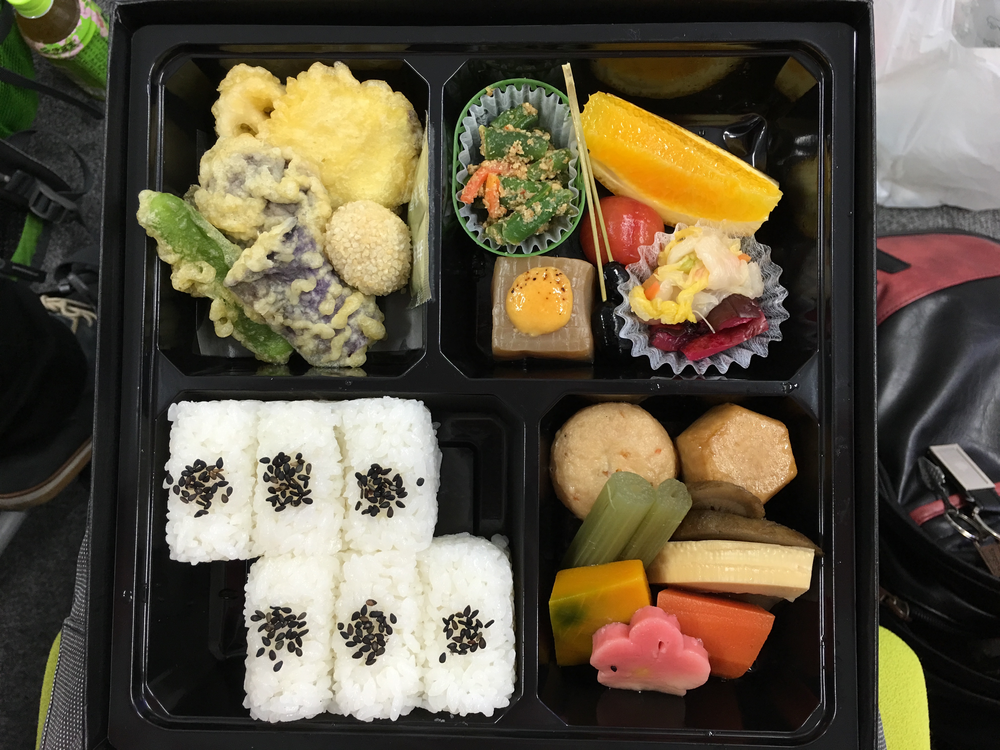

try! Swift Conf に参加してきた。
=========

ありがたいことに 3/2 から 3/4 にかけて [try! Swift conf](http://www.tryswiftconf.com/) に **スポンサー枠** で参加してきました。

行きたいなーでも個人でチケット買うには高いな…（全日程行こうと思ったら三万円:money_with_wings::money_with_wings::money_with_wings:）と二の足を踏んでたところにスポンサー枠チケットあるとの話を聞いて反射的に手を挙げたところ、実際に行かせて頂いて圧倒的感謝 :pray::pray::pray:

# カンファレンスの要約

主催の [kishikawakatsumi](https://github.com/kishikawakatsumi) 氏が国内外含めた iOS エンジニアの中でも間違いなく第一線で活躍している方で、その方の呼び掛けもあって国内外の著名な iOS アプリケーションエンジニアが一堂に会する機会となりました。

凄い人が声掛けたから凄い人達が集まったよ、という感じですね。勉強会の質は主催者の力量によるなと痛感させられる感じでもありますね。

# 非技術者へ向けての小噺

こういうエンジニア向けのカンファレンスとか勉強会に行くと常に雇用の流動性を感じます。

集まる人はあまり変わらない（書ける人は今も昔も変わらず書けるみたいな）けど所属してる会社は変わってるみたいな感じで同窓会のような様相になります。

こういうところにスポンサーとしてお金を出して企業の存在感をアピールしていくのは **「我々は技術者の文化を大事にしますよ！技術の発展を願ってます！！一緒に作っていきましょう！！！」** というメッセージにもなり、会社の守りのブランディングとして大事だなぁと思います。

逆に、昨今ではこういうカンファレンスに出向いては直接人を雇う・ "We are hiring!!" とアピールすることは流行っていないように感じます。そういった攻めのブランディングではなく、 **「優秀なエンジニアが集まるところには金と時間を提供するのが IT 企業としての社会的な責任だよね」** みたいな風潮になってるのかもしれない **（完全に個人の主観です）**。

- イベント T シャツの背中に印刷されたスポンサー企業各社のロゴ

僕はたまたまプログラマとしてエンジニア向けのカンファレンスに参加して上記の様な感想を抱きましたが、恐らくエンジニアだろうがなんだろうがあまり関係ない話として、オープンに人が集まるところ・社会的な責任をアピールできそうなところにスポンサーとしてリソースを提供することの大事さというものは一定存在すると思いますので、そういうところで常にクールな姿勢でありたいですねという感じです。

# 雰囲気というか空気感まとめ

- 後ろから撮ったセッションの様子

- 昼休みに充電ステーションに生えた MacBook の群れ

- 配られた 3 種類の弁当の中でもベジタリアン向けのものが一番美味しかった

- 誰かが [Tim Oliver](https://twitter.com/TimOliverAU) 氏のことをタイポなんかで [Tom Oliver](https://en.wikipedia.org/wiki/Tom_Oliver) って呼んで、その後スピーカー達が続々と Twitter で自分の名前を Tom Oliver に変更しまくってツイートしてて誰が誰だか分からなくなってた。
  - Tim Oliver 氏自体のセッションは `Core Animation` に関するもので、とにかく `Core Animation` サイコーという話をしていた。
    - 僕も `Core Animation` 大好きなので Tim Oliver 氏サイコーという感じだった。
      - なお Tim Oliver 氏はカラオケが大好きなようで、 2 日目の夜にスピーカーディナーが終わった後ノリの良い有志で遅くまでカラオケしてたとかしてないとか。 

- try! Swift カンファレンスは 3 日間ぶっ続けだったのだけど、最終日に重たい内容が集中してて、特に [inamiy](https://twitter.com/inamiy) 氏の構文木解析あたりの話が難易度としては最高にピークだったのだけど、参加者の疲れもピークなところに重ねて来るとは結構ドSな感じだなと思った。
  - inamiy 氏のセッションの内容は最高で、成果物の [TryParsec](https://github.com/inamiy/TryParsec) も最高でした。凄い人が同じ会社に居るなと思ってそれだけでワクワクした。

- 最終日全員が参加出来る打ち上げ会場の人口密度が高すぎて身動きがほぼ取れなかった図

- 2 日目のスピーカーディナーのときに初めて同じ会社で働いてるはずの inamiy さんと挨拶することが出来て、翌日の最終日のパーティーで inamiy さんの紹介で初めて同じ会社で働いてる人達に挨拶するイベントなどが発生した。

- 最終日のパーティで一人でウロウロしてたら [_ishkawa](https://twitter.com/_ishkawa) 氏に **「Do you enjoy party???」** と、とにかくひたすら煽られた。

# 技術的に有益だった話

### とても役に立つ書き起こしまとめ。

- [try! Swift 全日程聞き起こしまとめ | #tryswiftconf 3日間を終えての感想、家に帰ってからが try! Swift です！ | niwatakoのはてなブログ](http://niwatako.hatenablog.jp/entry/2016/03/05/022452)
- [try! Swift 資料まとめ | Qiita mishimay](http://qiita.com/mishimay/items/895d676eb9940d75e639)

### 個人的に良かったと思った話

- 良かった話が多すぎて全部書いてるとキリがなくなってしまうので、本当に掻い摘んで少しだけ挙げます。

- 僕が見てる範囲の日本で iOS アプリケーションエンジニアやってる人からは「コードで View を作るとかないでしょ。Autolayout + SizeClass の時代だし IB 使おう。不便さもあるけど総じて便利さの方が上回るよね」という雰囲気を感じてたんだけど、向こうの人達はそうでもないっぽい？

- 海外勢がやたらポケモンを推してくるなと思ったら、スピードスター（技名）が英語版だと Swift となっているらしい。
  - http://bulbapedia.bulbagarden.net/wiki/Swift_(move)
    - ポケモン 20 周年おめでとうございます！！思い出補正に負けて 3DS の VC で赤版とピカチュウ版買いました！！！セレクトバグ最高！！！！

##### xcodeless - the buildsystem | [@Daniel1of1](https://twitter.com/daniel1of1)
- Objective-C Runtime を使ってない Swift ネイティヴな実装でも `memcpy` で強引に vTable を書き換えてやれば Method Swizzle 出来るよという話。
- 該当セッションの書き起こしは [こちら](http://niwatako.hatenablog.jp/entry/2016/03/04/153514)

##### 実践的クロスプラットフォーム Swift | [@simjp](https://twitter.com/simjp)
- Swift ネイティヴで書いてるはずでも何処かに Objective-C Runtime に依存してしまうことがあって、ここら辺の闇が深くて簡単には解決手法を見付けられず Linux 上で動作させられない事例があるという話。
  - `Result` の（たぶんキャスト部分のどこかだと睨んでるんだけど違うかもしれないところの何処か）に Objective-C Runtime に依存してるっぽくて、調べたけどこりゃダメだ、ごめんわからないわｗ とのこと。
- 該当セッションの書き起こしは [こちら](http://niwatako.hatenablog.jp/entry/2016/03/02/105742)

##### プロトタイピングの魔法 | [@b3ll](https://twitter.com/b3ll) 
- iOS 6 時代のアニメーション設計は良かった。iOS 7 からのフラットデザインはダメだみたいな話をしてた。
  - 私見ですが完全に同意です。
    - `CALayer` は難しいという話になって、初日に `CALayer` 最高！！って話をしてた [Tim Oliver](https://twitter.com/TimOliverAU) 氏がしょんぼりしてたとのこと。
- Xcode 7.3 からは Playground で UIGestureRecognizer 使えてプロトタイピング出来るよという話。
  - UIDynamics のデバッグ最高に便利。
    - 私見なんだけど、これって要するに OSX 上で UIKit が動くよってことなので AppKit を捨てて UXKit でアプリ開発出来る未来に期待が掛かる。
- 該当セッションの書き起こしは [こちら](http://niwatako.hatenablog.jp/entry/2016/03/03/113028)

##### Swift ヒップスター | [@allonsykraken](https://twitter.com/allonsykraken)
- `lazy var` はクロージャと同じでキャプチャが走るんだけど、一見パッとそうは見えないから気を付けないとリークしちゃうよという話。
- 該当セッションの書き起こしは [こちら](http://niwatako.hatenablog.jp/entry/2016/03/04/131157)

##### オープンソース Swift への貢献 | [@jesse_squires](https://twitter.com/jesse_squires)
- OSS への貢献という話だったけど、気持ちの良いチームプレイをしていくためのノウハウといった側面もあって、汎用性の高いエモい話で大変良かった。
  - 「例えば Typo の修正などは細かいことにも思えるけど、非英語圏の人達にはそれが typo なのか分からない場合があって、翻訳が出来なくなることすら考えられる。小さな貢献も必ず誰かの役に立つんだよ。」
  - 「Swift をより良いものにしようという気持ちはみんな一緒だから、お互いを尊敬・尊重していこう。小さな貢献には価値があるし、提案のリジェクトは貴方の人格を否定してる訳じゃないよ。」
    - [わかる。](https://twitter.com/DNPP/status/705673167243649024)
- 該当セッションの書き起こしは [こちら](http://niwatako.hatenablog.jp/entry/2016/03/04/173304)
